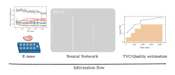

# MeatNet: An FPGA-based Machine Learning tool for in-situ food quality tracking using sensor fusion

This repository contains the code used in the paper entitled **An FPGA-based Machine Learning tool for in-situ food quality tracking using sensor fusion** from MDPI *Biosensors*.

If you find it useful, please consider cite us:

- Enériz, D.; Medrano, N.; Calvo, B. An FPGA-Based Machine Learning Tool for In-Situ Food Quality Tracking Using Sensor Fusion. *Biosensors* **2021**, *11*, 366. [https://doi.org/10.3390/bios11100366](https://doi.org/10.3390/bios11100366)

- ``` @article{En_riz_2021, title={An FPGA-Based Machine Learning Tool for In-Situ Food Quality Tracking Using Sensor Fusion}, volume={11}, ISSN={2079-6374}, url={http://dx.doi.org/10.3390/bios11100366}, DOI={10.3390/bios11100366}, number={10}, journal={Biosensors}, publisher={MDPI AG}, author={Enériz, Daniel and Medrano, Nicolas and Calvo, Belen}, year={2021}, month={Sep}, pages={366}} ```




## Requirements

In [requirements.txt](/requirements.txt) you can find the list of required packages and their versions used in the development of this project.

It is also recommended to run the notebooks in a Jupyter environment where the `vivado_hls` command is enabled, since the HLS simulations are automatically launched from Python using the `.tcl` scripts, that load the HLS-related files (`MeatNet-XXX.X`).

## Contents

This work is contained in the four notebooks included in the repo. In [consumption.ipynb](/consumption.ipynb) you can find the steps to generate the World's consumption meat consumption, which motivated this work.

All the steps to download, visualize, and preprocess the dataset are contained in the [virtualization.ipynb](/virtualization.ipynb), where the training process is also contained. After this, the main results of regression and classification of the trained models are also included.

Finally, in [implementation.ipynb](/implementation.ipynb) you will find the fixed-point datatype selection process, the retraining and the final HLS simulation. Then, there is a guide to generate the FPGA-implemented results, whose results are compared with the rest of the model stages.

The fourth notebook is [fpga.ipynb](/fpga.ipynb), which contains the custom driver and the FPGA-performance test. This notebook must be uploaded and run in the PYNQ-Z2 file system (or whichever your board is).